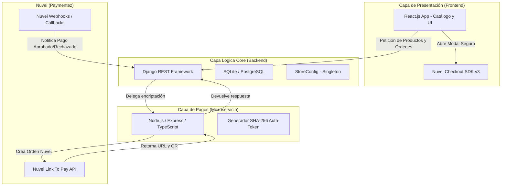

# 🍷 Guía Definitiva de Implementación — Plataforma E-Commerce Licorería Virtual

Este documento describe la arquitectura, stack tecnológico y flujo de integración de la plataforma de e-commerce desarrollada para la Licorería, con enfoque principal en la integración nativa de la pasarela de pagos **Nuvei (Paymentez) Ecuador**.

---

## 🏗️ 1. Arquitectura del Sistema (3 Capas)

El sistema ha sido diseñado bajo una arquitectura de microservicios y separación de responsabilidades (Frontend, Backend Core y Microservicio de Pagos), garantizando escalabilidad, seguridad (aislamiento de credenciales) y mantenibilidad.



---

## 🛠️ 2. Stack Tecnológico Detallado

El proyecto utiliza tecnologías modernas y estándares de la industria para cada componente:

### Frontend (Interfaz de Usuario)
*   **Core:** React.js 18
*   **Build Tool:** Vite (Para compilación ultra rápida y HMR)
*   **Estilos:** CSS3 Vanilla con arquitectura basada en variables nativas (CSS Variables) y diseño UI tipo "Glassmorphism" y modo oscuro (Dark Mode).
*   **Librerías Adicionales:** 
    *   `axios`: Para peticiones asíncronas al Backend.
    *   `lucide-react`: Para iconografía vectorial (SVG).
    *   `jquery`: Requisito estricto como dependencia del SDK de Nuvei.
*   **SDK Pago:** Nuvei Payment Checkout v3.0.0 (`payment_checkout_3.0.0.min.js`).

### Backend (Lógica Core y Base de Datos)
*   **Framework:** Python 3.10+ con Django 5.x.
*   **API Framework:** Django REST Framework (DRF).
*   **Base de Datos:** SQLite (Entorno local/Desarrollo) → PostgreSQL (Producción).
*   **Manejo de CORS:** `django-cors-headers` para permitir peticiones seguras desde el Frontend.
*   **Librería HTTP:** `requests` para comunicación síncrona con el microservicio de pagos.

### Microservicio de Pagos
*   **Runtime:** Node.js v18+.
*   **Lenguaje:** TypeScript (Tipado estricto para payloads de Nuvei).
*   **Framework API:** Express.js.
*   **Seguridad:** Generación nativa de hashes criptográficos (`crypto`) para firmas SHA-256 y Base64.

---

## 💳 3. Especificaciones Técnicas y Reglas de Negocio (Nuvei API)

### A. Ambientes / Endpoints
| Ambiente | Cards API Base URL | Cash/LinkToPay/Wallets Base URL |
|---|---|---|
| **Staging (STG)** | `https://ccapi-stg.paymentez.com` | `https://noccapi-stg.paymentez.com` |
| **Production (PROD)** | `https://ccapi.paymentez.com` | `https://noccapi.paymentez.com` |

### B. Autenticación (Auth-Token)
Todas las peticiones backend hacia Nuvei requieren el header `Auth-Token`.
Se construye combinando las credenciales de la aplicación y el hash SHA-256:
```python
SHA256_HASH = sha256(APP_KEY + UNIX_TIMESTAMP).hexdigest()
AUTH_TOKEN = base64(f"{APP_CODE};{UNIX_TIMESTAMP};{SHA256_HASH}")
```
> **Nota:** Las credenciales varían por ambiente (Client/Server y STG/PROD). Todas son manejadas dinámicamente desde el modelo `StoreConfig` de Django.

### C. Desglose de IVA — Ecuador
Nuvei exige que el desglose de impuestos sea exacto. Para Ecuador se aplican tarifas de 0%, 8% y 15%.
*   `amount`: Total a pagar (Base + IVA)
*   `taxable_amount`: Base imponible (Antes del IVA)
*   `vat`: Monto calculado de IVA
*   `tax_percentage`: 0, 8 o 15
*   `currency`: "USD"

### D. Flujo 1: Link to Pay API (Generación de enlaces)
*   **Endpoint:** `POST /linktopay/init_order/`
*   **Payload Base:**
    ```json
    {
      "user": { "id": "123", "email": "teban@test.com", "name": "Juan", "last_name": "Perez" },
      "order": {
        "dev_reference": "ORD-001",
        "description": "Pedido Licorería",
        "amount": 46.00,
        "vat": 6.00,
        "taxable_amount": 40.00,
        "tax_percentage": 15,
        "currency": "USD"
      },
      "configuration": { "success_url": "...", "webhook_url": "..." }
    }
    ```
*   **Retorno:** Un objeto JSON conteniendo el `payment_url` y una cadena base64 con el `payment_qr`.

### E. Flujo 2: Checkout Nativo (Modal)
*   **Init Reference Endpoint:** `POST /v2/transaction/init_reference/`
*   El backend envía los detalles del usuario y de la orden junto con un objeto `conf` para darle estilo visual al modal.
    ```json
    "conf": {
      "style_version": "2",
      "theme": { "logo": "url-logo", "primary_color": "#C800A1" }
    }
    ```
*   Nuvei retorna un `transaction_id` (o `reference`).
*   **Frontend SDK:**
    ```javascript
    let paymentCheckout = new window.PaymentCheckout.modal({
      env_mode: "stg", // o prod
      onResponse: function(response) { /* Validar success */ }
    });
    paymentCheckout.open({ reference: "referencia_del_backend" });
    ```

---

## 📡 4. Webhooks (Comunicación Asíncrona Server-to-Server)

No basta con que el cliente vea un "Pago Exitoso" en su pantalla. Para automatizar la entrega del producto y validar que los fondos realmente ingresaron, se implementó un **Webhook**.

*   **Endpoint:** `POST /api/orders/webhook/`
*   **Seguridad:** Abierto (`AllowAny`) para recibir peticiones de servidor a servidor.
*   **Flujo:**
    1.  Nuvei dispara un POST automático.
    2.  El Backend intercepta el payload y extrae el `dev_reference`.
    3.  Busca la orden, extrae `status` y `authorization_code`.
    4.  Si es exitoso, la orden cambia a **"PAID" (Pagado)** y se guarda el código de autorización del banco.

---

## 🌍 5. Guía de Despliegue en Producción (Hosting)

Para llevar este sistema a internet para el uso de clientes reales:

### Paso 1: Backend en la Nube (Ej: Render.com o Railway.app)
*   **Base de datos:** Migrar a un cluster de **PostgreSQL**.
*   **Entorno Seguro:** Apagar el modo de depuración (`DEBUG = False` en Django).
*   **Variables de Entorno (.env):** Alojar las llaves secretas de Nuvei en las configuraciones del servidor y nunca en código duro.
*   **Dominio Seguro:** El servidor debe correr estrictamente sobre **HTTPS** (SSL), de lo contrario Nuvei rechazará las peticiones Webhook.

### Paso 2: Microservicio de Node.js
*   Debe hostearse idealmente en la misma red privada (Private Network) que Django para eliminar latencias de red.

### Paso 3: Frontend (React)
*   **Plataforma sugerida:** Vercel o Netlify.
*   **Integración:** Actualizar la URL de `axios` para que apunte al dominio en producción donde se encuentra alojado Django.

### Paso 4: Configuración Final en Panel de Nuvei
*   Acceder al dashboard de administración de Paymentez/Nuvei (Producción).
*   Registrar la URL final pública del servidor Django en la sección de Webhooks: `https://api.midominio.com/api/orders/webhook/`.
